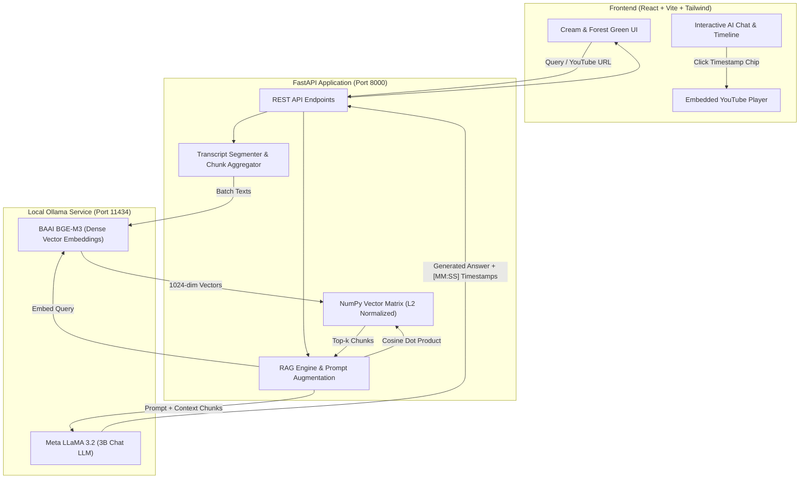

# 🎬 TubeMind AI — Interactive YouTube Video RAG System

[](https://reactjs.org/)
[](https://vitejs.dev/)
[](https://tailwindcss.com/)
[](https://fastapi.tiangolo.com/)
[](https://ollama.ai/)
[-0467DF?style=for-the-badge&logo=meta&logoColor=white)](https://ai.meta.com/llama/)
[](https://huggingface.co/BAAI/bge-m3)

> An end-to-end, multimodal **Retrieval-Augmented Generation (RAG)** platform that transforms long-form YouTube videos into an interactive, question-answering intelligence dashboard with **synchronized timestamp playback** — powered 100% locally by **LLaMA 3.2** and **BGE-M3** embeddings via Ollama.

---

## 🌟 Key Features

- **⚡ 100% Local & Zero API Cost**: Runs completely offline and privately via Ollama using **LLaMA 3.2 (3B)** for contextual synthesis and **BGE-M3** for dense multilingual embeddings.
- **🎯 Bidirectional Timestamp Synchronization**: When the AI cites a timestamp (e.g. `▶ 02:45`) in its response or transcript chunks, clicking it **instantly seeks the embedded YouTube video** to that exact second.
- **🔍 Vectorized Sub-Millisecond Search**: Fast matrix dot-product cosine similarity powered by NumPy over L2-normalized vector buffers.
- **📥 Dynamic Video Ingestion**: Paste any YouTube link — the pipeline automatically extracts spoken transcripts, creates semantic chunks, generates BGE-M3 embeddings, and indexes the video in real-time.
- **✨ Executive Summarizer & Chapters**: 1-click comprehensive summaries, bulleted key takeaways, and timeline chapter breakdowns.
- **🎨 Warm & Elegant Aesthetic**: Designed with a refined **Cream (`#FAF7F2`), Sage & Forest Green (`#245937`), and Clean White (`#FFFFFF`)** color palette.
- **⭐ Pre-Indexed Demo Included**: Comes pre-loaded with over 2,100 vectorized chunks from a complete technical course, allowing immediate testing without waiting.

---

## 🏗️ System Architecture



---

## 🚀 Quick Start Guide

### Prerequisites
1. **Python 3.10+**
2. **Node.js 18+** & `npm`
3. **Ollama** installed and running with `llama3.2` and `bge-m3`:
   ```bash
   ollama pull llama3.2
   ollama pull bge-m3
   ```

### 1-Click Launch (Windows)
Double-click `start.bat` or run:
```powershell
.\start.ps1
```
This automatically starts both the FastAPI backend and Vite frontend!

---

### Manual Setup

#### 1. Backend Setup
```bash
# Install dependencies
pip install -r backend/requirements.txt

# Start the FastAPI backend
python -m uvicorn backend.app:app --host 127.0.0.1 --port 8000 --reload
```
API Documentation will be available at: [http://localhost:8000/docs](http://localhost:8000/docs)

#### 2. Frontend Setup
```bash
cd frontend

# Install packages
npm install

# Start Vite development server
npm run dev
```
Open your browser at: [http://localhost:5173](http://localhost:5173)

---

## 📡 API Overview

| Method | Endpoint | Description |
|---|---|---|
| `GET` | `/api/health` | Health status of backend and Ollama connectivity (`llama3.2` & `bge-m3`) |
| `GET` | `/api/videos` | Returns list of all indexed videos with metadata |
| `GET` | `/api/chunks/{video_id}` | Full list of timestamped transcript chunks for interactive browsing |
| `POST` | `/api/chat` | RAG retrieval + LLaMA 3.2 synthesis with timestamp citations |
| `POST` | `/api/summarize` | Executive summary, takeaways, and timeline chapters |
| `POST` | `/api/process-video` | Ingests new YouTube URL, extracts transcript, chunks, and vectorizes |

---

## 💼 LinkedIn Showcase Kit

Want to showcase this project to recruiters and your network? We've embedded a 1-click **LinkedIn Showcase Post Kit** directly in the app header!

### Sample Post Template:
```text
🚀 Excited to share my latest project: TubeMind AI — an Interactive Video RAG System powered by local LLaMA 3.2 & BGE-M3!

Have you ever sat through a 2-hour technical video just to locate one 30-second explanation? I wanted to solve this with local AI.

I built a full-stack Retrieval-Augmented Generation (RAG) platform that turns long-form YouTube videos into an interactive, question-answering intelligence dashboard with zero cloud API costs.

✨ Key Highlights:
🔹 Local & Private AI: Powered by Ollama running Meta's LLaMA 3.2 (3B) for contextual synthesis and BGE-M3 for high-density multilingual embeddings.
🔹 Vectorized Similarity Search: Transcripts are segmented into timestamped semantic chunks and indexed into normalized vector matrices for sub-millisecond retrieval.
🔹 Bidirectional Video Sync: Every AI citation includes clickable [MM:SS] timestamp chips. Clicking a citation instantly jumps the embedded YouTube player to that exact second!
🔹 Video Intelligence Engine: 1-click executive summaries, key takeaways, and searchable transcript explorer.
🔹 Modern Full-Stack Architecture: React (Vite, Tailwind CSS, Lucide Icons) styled in an elegant Cream, Sage Green & White palette, backed by a high-throughput FastAPI service.

🛠️ Tech Stack: Python, FastAPI, NumPy, Pandas, Ollama, LLaMA 3.2, BGE-M3, React, Tailwind CSS.

Check out the GitHub repo and let me know your thoughts! 👇
#ArtificialIntelligence #MachineLearning #RAG #LLaMA #DataScience #WebDevelopment #ReactJS #Python #Ollama #OpenSource
```

---

## 📂 Project Structure

```
dsproject1/
├── backend/
│   ├── app.py                 # FastAPI REST API endpoints & CORS
│   ├── rag_engine.py          # Vector search, Ollama client, YouTube ingestion
│   └── requirements.txt       # Backend dependencies
├── frontend/
│   ├── src/
│   │   ├── components/
│   │   │   ├── Navbar.jsx            # Status badges, model pills, modal buttons
│   │   │   ├── VideoBar.jsx          # YouTube URL input & pipeline stepper
│   │   │   ├── VideoPlayer.jsx       # Embedded player with synchronized seek
│   │   │   ├── ChatTab.jsx           # AI chat with clickable timestamp pills
│   │   │   ├── SummaryTab.jsx        # Executive summary & takeaways
│   │   │   ├── ChunksTab.jsx         # Searchable transcript chunk explorer
│   │   │   ├── ArchitectureModal.jsx # System architecture modal
│   │   │   └── LinkedInModal.jsx     # Copyable LinkedIn portfolio kit
│   │   ├── App.jsx                   # Main layout and state orchestration
│   │   ├── api.js                    # Backend API client
│   │   └── index.css                 # Custom Tailwind theme (Cream, Green, White)
│   ├── tailwind.config.js            # Color system configuration
│   └── package.json
├── video_store/               # Fast binary numpy matrix & metadata cache
├── chunks.json                # Pre-extracted transcript dataset
├── embedded_chunks.csv        # Pre-calculated BGE-M3 embeddings
├── start.bat                  # 1-click Windows launcher
├── start.ps1                  # PowerShell launcher
└── README.md                  # Showcase documentation
```

---

## 📜 License
MIT License. Feel free to use, modify, and showcase in your portfolio!
